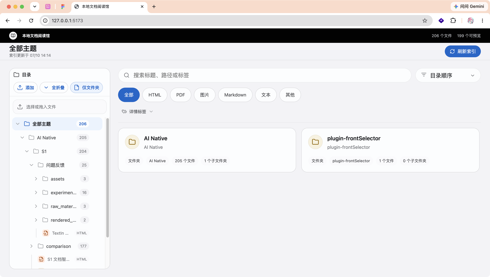
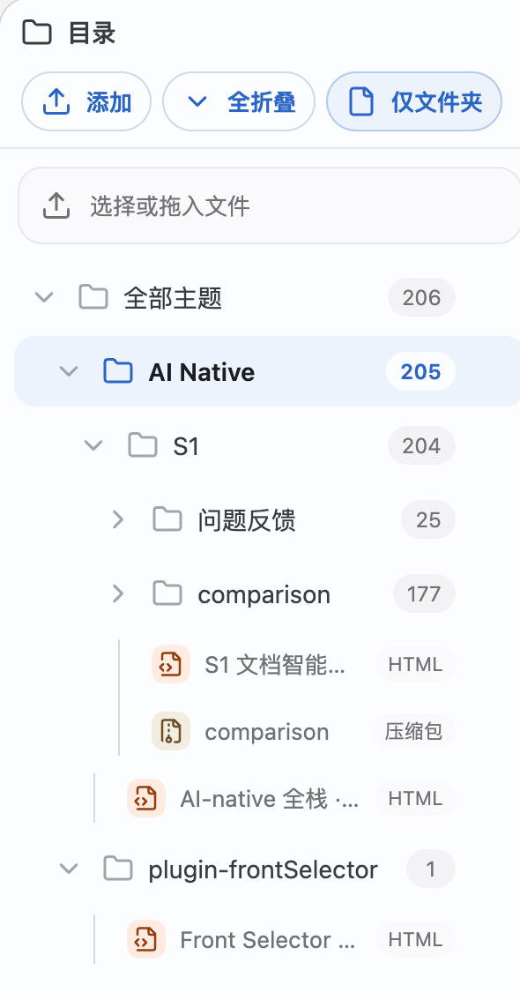
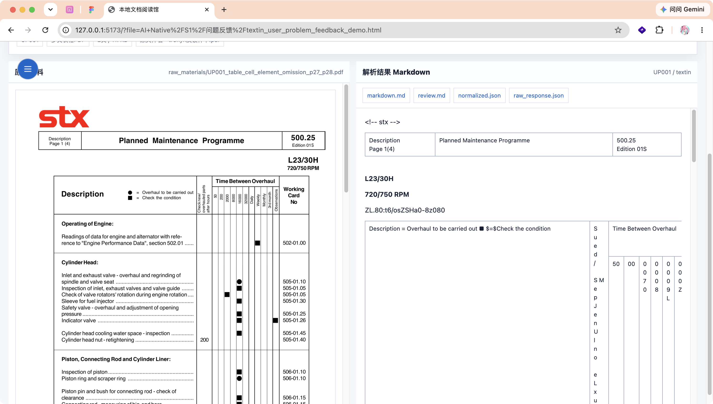
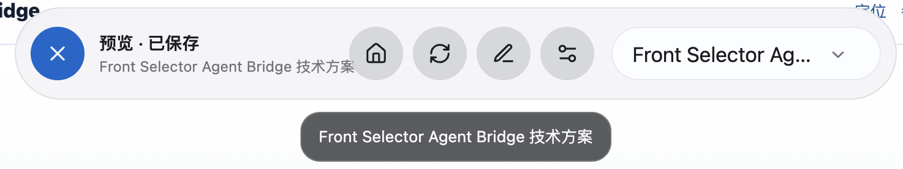
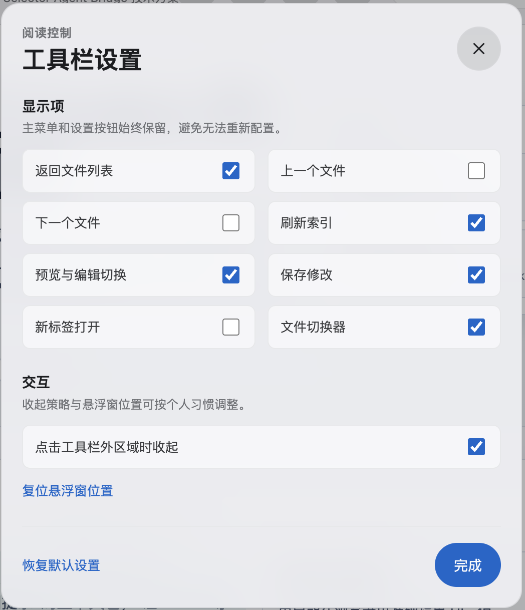

# 本地文档阅读馆

一个本地 Web 文档阅读平台。文件统一放入 `library/`，平台会按目录生成主题、按扩展名识别类型，并在浏览器里提供统一入口和阅读页。

## 界面示例











> 注意：macOS 悬浮启动器目前仍在测试中。为获得更稳定的体验，建议优先在终端运行 `npm run dev`，再通过浏览器访问平台。

## 启动

```bash
npm install
npm run dev
```

默认地址是 `http://127.0.0.1:5173`。

## 放置文件

把文件放入 `library/` 下的任意目录。目录就是主题层级，例如：

```text
library/
  S1/
    s1-followup-plan.html
  论文/
    资料.pdf
  图片/
    reference.png
```

首个验证样例已复制到：

```text
library/S1/s1-followup-plan.html
```

原始文件 `s1-followup-plan.html` 保留在项目根目录，便于对照。

## 支持范围

- HTML：在平台内全屏 iframe 阅读，保留原页面样式。
- PDF：使用浏览器原生预览。
- 图片：平台内居中预览。
- Markdown / 文本：平台内基础阅读。
- 其他文件：保留打开入口。

## 可选元数据

根目录的 `library.meta.json` 可以覆盖标题、标签、排序或隐藏文件：

```json
{
  "items": {
    "S1/s1-followup-plan.html": {
      "title": "S1 文档智能解析横评补充计划",
      "tags": ["样例", "HTML", "S1"],
      "order": 1,
      "hidden": false
    }
  }
}
```

路径必须相对 `library/`。

## 检查

```bash
npm run typecheck
npm run test
npm run build
```

## macOS 悬浮启动器（测试中）

可以把平台打包成一个轻量的 macOS 悬浮启动器。它不嵌入阅读页面，只负责按需启动本地服务并打开默认浏览器。该模式仍在测试，日常使用建议优先采用上方的终端启动方式。

构建完整应用入口：

```bash
npm run build:launcher
```

也可以只重新打包启动器：

```bash
scripts/build-launcher.sh
```

注意：`npm run build` 会清理 `dist/`，如果你刚构建过 `.app`，再运行 `npm run build` 会把它删除。需要最终产物时请使用 `npm run build:launcher`。

生成位置：

```text
dist/本地文档阅读馆.app
```

双击这个 `.app` 后会出现一个小悬浮窗：

- `启动并打开`：检查 `http://127.0.0.1:5173/api/health`，未运行则在项目根目录执行 `npm run dev`，启动成功后打开平台。
- `打开`：直接在默认浏览器打开 `http://127.0.0.1:5173`。
- `刷新`：重新检查服务状态。
- `停止`：只停止本启动器本次启动的服务进程；不会停止你在终端手动启动的服务。

状态说明：

- `未运行`：5173 端口没有可用服务。
- `正在启动服务`：启动器已执行 `npm run dev`，正在等待健康检查通过。
- `运行中（由启动器启动）`：服务由当前启动器启动，可以通过浮窗停止。
- `已运行（外部进程）`：服务已经在运行，但不是当前启动器启动，停止按钮会禁用。
- `端口被占用/服务异常`：5173 有进程监听，但健康检查不正常。

如果启动失败，可查看本地日志：

```text
.launcher/document-gallery.log
```

如果移动了项目目录，请重新运行 `scripts/build-launcher.sh`，因为 `.app` 会记录构建时的项目根路径。
